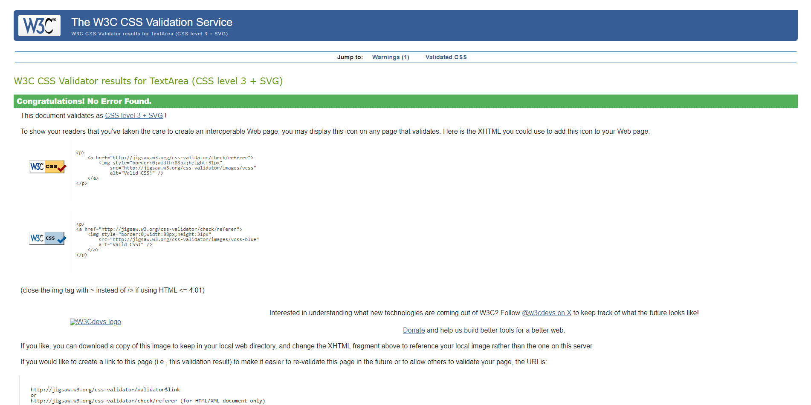

# **Revforum**

## **Overview**

Revforum is an online forum made with Django framework. It allows people with their shared love for motorcycle to exchange options and experiences. On categories created by the admin, the users can create their own posts and comment on posts made by themselves or others. They can also like and favourite posts.

## Table of contents

- [**Revforum**](#revforum)
  - [**Overview**](#overview)
  - [Table of contents](#table-of-contents)
  - [**Planning stage**](#planning-stage)
    - [**Target Audiences:**](#target-audiences)
    - [**User Stories:**](#user-stories)
    - [**Site Aims:**](#site-aims)
    - [**Forum Structure:**](#forum-structure)
  - [**Current Features**](#current-features)
      - [*Main Screen:*](#main-screen)
      - [*Post List screen:*](#post-list-screen)
      - [*Post screen:*](#post-screen)
      - [*Post screen:*](#post-screen-1)
  - [**Future-Enhancements**](#future-enhancements)
  - [**Testing Phase**](#testing-phase)
  - [**Validators**](#validators)
  - [**Bugs**](#bugs)
  - [**Deployment**](#deployment)
  - [**Tech**](#tech)
  - [**Credits**](#credits)
    - [**Honorable mentions**](#honorable-mentions)
    - [**Content:**](#content)

## **Planning stage**

### **Target Audiences:**

* Users interested in motorcycles.
* Users interested in interact with other people with shared loved for motorcycles.
* Users interested in share their experiences.
​

### **User Stories:**

* As a user, I want to sign up.
* As a user, I want to sign in.
* As a user, I want to sign out.
* As a user, I want to choose a category to see its posts.
* As a user, I want to make a post.
* As a user, I want to add a photo to my post.
* As a user, I want to update a post.
* As a user, I want to delete a post.
* As a user, I want to like a post.
* As a user, I want to comment a post.
* As a user, I want to update a comment.
* As a user, I want to delete a comment.
* As an administrator, I want to create a category.
* As an administrator, I want to review a flagged post.
​

### **Site Aims:**

* To create a space for conversation regarding motorcycles.
* To present itself as another option for users to get and share information.
* To incentivate discussions.
* To facilitate the spread of information, specially regarding events or similar.
* To provide an excellent user experience without any errors or bugs.

### **Forum Structure:**

## **Current Features**

​

#### *Main Screen:*

* Main screen of the forum. User or visitors (they do not have to be logged) can see the categories.

#### *Post List screen:*

* Once the user/visitor clicks in one category, they are then redirected to all the posts inside that category. If the user is logged, the page shows the favourite posts first, from the newest to the last one.

#### *Post screen:*

* When the user clicks the post, they are presented with: the title, the description, who made it, when it was made, the possibility to like and comment.

#### *Post screen:*

- When the user clicks the post, they are presented with: the title, the description, who made it, when it was made, the possibility to like and comment.

​

## **Future-Enhancements**

​

* Users could log through their social networks profiles (FB, X) or email.
* Create a profile page where users can add their personal photos and descriptions.
* Users could report a post to be checked by the admin.
​

## **Testing Phase**

​

Implementation: Create new category as admin.

Test: Access admin area and created new category.

Result: New category appeared on the website.
***

Implementation: Create button to allow user to crate new post.

Test: Clicked on button.

Result: New page with new post form created.
***

Implementation: Create new post inside a category.

Test: Fill out the form to create new post.

Result: New post added to the category.
***

Implementation: Button for the user to update post.

Test: Clicked on button.

Result: New page appeared with the update post form.
***

Implementation: Update post inside a category.

Test: Fill out the form to update post.

Result: Post page updated with the new information.
***

Implementation: Button for the user to delete post.

Test: Clicked on button.

Result: After confirmation, Posts list loaded without the deleted post.
***

Implementation: Create area to allow user to crate new comment.

Test: Typed the comment and clicked to post comment.

Result: Comment appeared on the page.
***

Implementation: Create button to update comment.

Test: Clicked on button.

Result: Post page updated with updated comment.
***

Implementation: Button for the user to delete comment.

Test: Clicked on button.

Result: After confirmation, Post page loaded without the deleted comment.
***

## **Validators**

. Lighthouse 
All pages passed the Lighthouse check.

. W3C HTML Validator 

. W3C CSS Validator 

. Python Linter 

## **Bugs**

Problem 🐞: User was redirected to the main page after making a new post.

Cause🛠: The redirect page was incorrect.

Resolution✅: View code changed to redirect to the posts list page.
***

Problem 🐞: User was redirected to the main page after updating a post.

Cause🛠: The redirect page was incorrect.

Resolution✅: View code changed to redirect to the post page.
***

Problem 🐞: Username of the user who made the comment on a post was not being shown.

Cause🛠: The code in the template was not correct.

Resolution✅: Change the code to retrieve the username of the comment saved on the database.
***

Problem 🐞: User was not being redirected to the post page if lhey liked/favourite the post.

Cause🛠: The redirect page was incorrect.

Resolution✅: View code changed to redirect to the post page.
***

Problem 🐞: Post counter within a category not showing the amount.

Cause🛠: Co-relation between models was incorrect.

Resolution✅: Changed to a ForeignKey relation.
***

## **Deployment**

## **Tech**

- Python.
- Django.
- Django-allauth.
- Cloudinary.
- Crispy-forms.
​

## **Credits**

### **Honorable mentions**

* Larissa Moura (my wife) - She was my tester and also my design guru.
* Richard Wells (my Code Institute tutor) - Help me throughout the project in all aspects.
​

### **Content:**

- Navbar based on the one used on the code along project "I Think Therefore I Blog" from [CodeInstitute] (<https://github.com/Code-Institute-Solutions/Django3blog>)
- Ability to like and favourite post based on Tutorial made by [VeryAcademy](<https://www.youtube.com/watch?v=H4QPHLmsZMU&ab_channel=VeryAcademy>)
- Stackoverflow. Without it, this project would never be completed.
